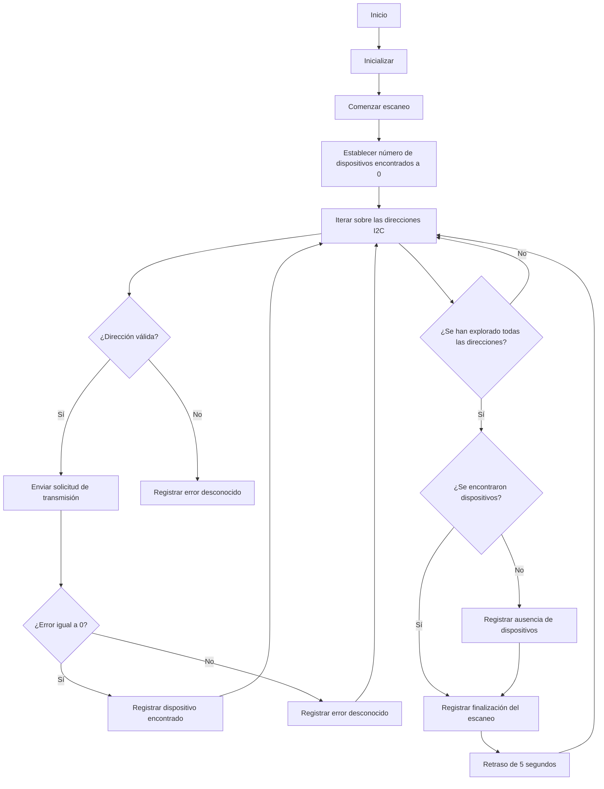

# Práctica 5: BUSES DE COMUNICACIÓN

## Introducción de la práctica
El funcionamineto de la práctica es trabajar con los buses de comunicación.

En esta práctica nos centraremos en el bus I2C , donde trabajaremos con el especializándonos en el Escáner del bus de comunicación I2C.

## EJERCICIO 1: ESCÁNER I2C

Código:

```c++
#include <Arduino.h>
#include <Wire.h>
void setup()
{
Wire.begin();
Serial.begin(115200);
while (!Serial);
Serial.println("\nI2C Scanner");
}
void loop()
{
byte error, address;
int nDevices;
Serial.println("Scanning...");
nDevices = 0;
for(address = 1; address < 127; address++ )
{
Wire.beginTransmission(address);
error = Wire.endTransmission();
if (error == 0)
{
Serial.print("I2C device found at address 0x");
if (address<16)
Serial.print("0");
Serial.print(address,HEX);
Serial.println(" !");
nDevices++;
}
else if (error==4)
{
Serial.print("Unknown error at address 0x");
if (address<16)
Serial.print("0");
Serial.println(address,HEX);
}
}
if (nDevices == 0)
Serial.println("No I2C devices found\n");
else
Serial.println("done\n");
delay(5000);
}

```
### Funcionamiento y salida por la terminal 
El programa dado, tiene la función de un escáner I2C que busca dispositivos conectados al bus I2C, va recorriendo a través de todas las posibles direcciones en el bus y mira si hay un dispositivo en cada una. Si encuentra un dispositivo, lo muestra en el puerto serie, además proporciona cuantos dispositivos a encontrado.

#### Funciones del código:
EL código aparte de incluir las 2 bibliotecas : 
#include <Arduino.h>
#include <Wire.h>

Tambien incluye de 2 funciones subprograma para hacer la funcionalidad del escáner DEL I2C.

- ##### *Función setup():*
  Se inicializan las comunicaciones I2C y serie (Serial). El bucle while (!Serial) espera hasta que el puerto serial esté disponible.
  
- ##### *Función loop():*
 En esta funcionalidad se realiza el escaneo del bus I2C. Se itera a través de todas las direcciones de 7 bits posibles (de 1 a 127) y se intenta iniciar una comunicación con cada dirección mediante Wire.beginTransmission(address). 
 
 Si hay error (error == 4), significa que hay un dispositivo en esa dirección y se imprime su dirección hexadecimal en el puerto serie. 
 
 Si no hay un error (error == 0), se imprime un mensaje indicando que hubo un error desconocido.
Después de escanear todas las direcciones, se verifica si se encontraron dispositivos. Si no encuentra ningun dispositivo, se imprime un mensaje diciendolo. Luego, se espera 5 segundos antes de comenzar el próximo escaneo.
  
### Salida por el puerto serie:

En el caso que encuentre dispositivos conectados mostrará por pantalla:
```
I2C Scanner
Scanning...
I2C device found at address 0x3F !
I2C device found at address 0x68 !
done
```
Y si no se encuentran dispositivos conectados en el bus I2C:
```
I2C Scanner
Scanning...
No I2C devices found
```
Diagrama sobre el funcionamiento:


## EJERCICIO PRÁCTICO 2: SENSOR TEMPERATURA Y HUMEDAD

```c++
#include <Arduino.h>
    #include <Wire.h>
    #include <AHT10.h>
    #include <LiquidCrystal_I2C.h>
    #include <Adafruit_Sensor.h>

    AHT10 aht10;
    LiquidCrystal_I2C lcd(0x27, 16, 2); // Dirección I2C y dimensiones del display LCD

    void setup() {
    Serial.begin(115200);
    Wire.begin(); // Inicializa la comunicación I2C
    lcd.init();   // Inicializa el display LCD
    lcd.backlight();
    
    if (!aht10.begin()) {
        Serial.println("Error al inicializar el sensor AHT10");
        while (1);
    }
    }

    void loop() {
    delay(2000); // Espera 2 segundos entre lecturas
    
    float temp = aht10.readTemperature(); // Lee la temperatura en Celsius
    float hum = aht10.readHumidity();     // Lee la humedad relativa
    
    // Imprime los datos en el monitor serial
    Serial.print("Temperatura: ");
    Serial.print(temp);
    Serial.print(" °C\t");
    Serial.print("Humedad: ");
    Serial.print(hum);
    Serial.println("%");

    // Imprime los datos en el display LCD
    lcd.clear();
    lcd.setCursor(0, 0);
    lcd.print("Temp: ");
    lcd.print(temp);
    lcd.print(" C");

    lcd.setCursor(0, 1);
    lcd.print("Humedad: ");
    lcd.print(hum);
    lcd.print("%");
    }
```
### Funcionamiento y salida por la terminal 
Este código es para un dispositivo que lee la temperatura y la humedad utilizando el sensor AHT10, luego muestra estos datos en un monitor serial y en un display LCD.

#### Funcionalidades

En el setup(), se inicializa la comunicación serial, I2C y el display LCD, y se verifica si el sensor AHT10 está funcionando correctamente.

En el loop(), se lee la temperatura y la humedad cada 2 segundos, se imprimen estos valores en el monitor serial y se muestran en el display LCD.

### Salida por el puerto serie:

La salida son la temperatura y humedad captada.

En nuestro caso la salida por el puerto serie:

```
Temperatura: 22.99 °C   Humedad: 55.91%
Temperatura: 22.99 °C   Humedad: 55.83%
Temperatura: 22.99 °C   Humedad: 55.78%
```

### Fotografías de la práctica

